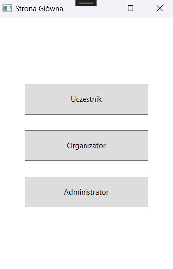
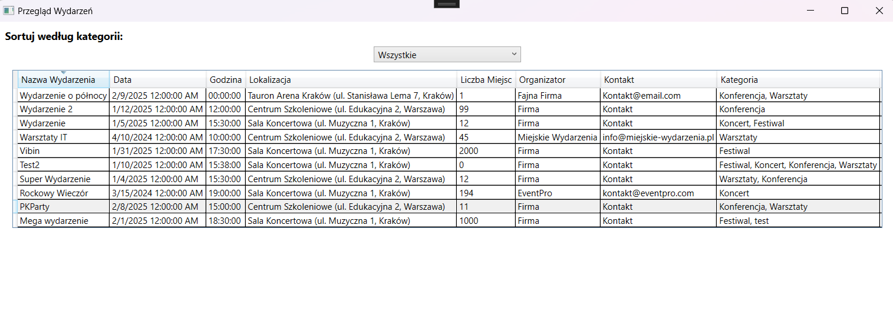
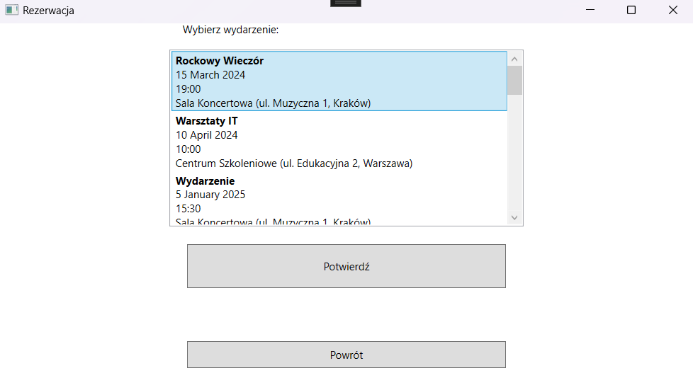
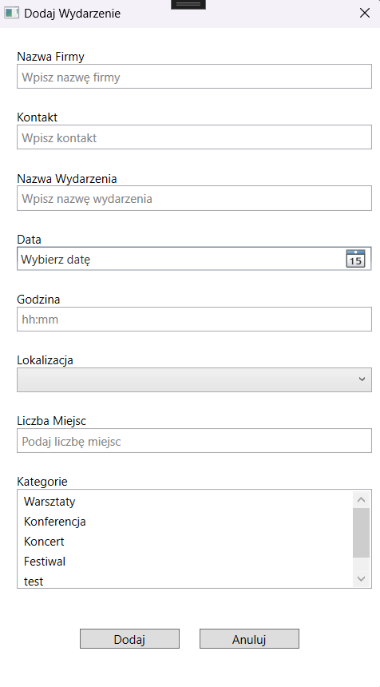
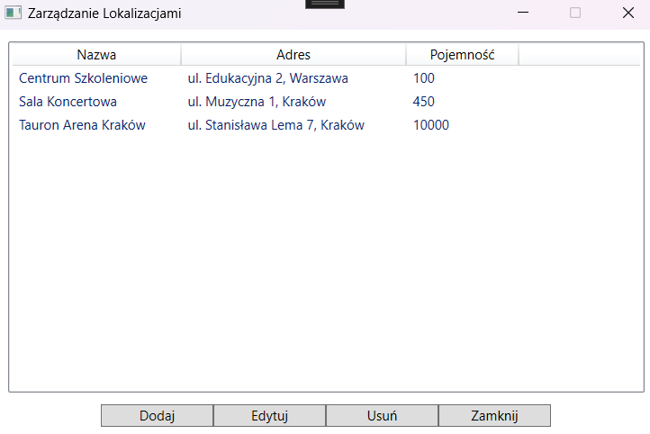

# **System zarządzania wydarzeniami w mieście**

## 📌 Opis projektu  
Aplikacja umożliwia zarządzanie wydarzeniami w mieście. System pozwala użytkownikom na:
- Dodawanie wydarzeń, rezerwację miejsc i zarządzanie lokalizacjami.
- Obsługę ról użytkowników: **Administrator**, **Organizator**, **Uczestnik**.
- Generowanie raportów i statystyk.
- Intuicyjną obsługę za pomocą graficznego interfejsu użytkownika (GUI) opartego na **WPF**.

---

## 🛠 **Technologie użyte w projekcie**
- **C# (.NET Framework 4.7.2)**
- **WPF** (Windows Presentation Foundation)
- **PostgreSQL** (baza danych)
- **Npgsql** (obsługa bazy danych)

---

## 🎯 **Funkcjonalności**

### 🔹 Zarządzanie wydarzeniami  
✅ Dodawanie nowych wydarzeń przez organizatorów  
✅ Weryfikacja liczby dostępnych miejsc  
✅ Powiązanie wydarzeń z lokalizacjami i kategoriami  

### 🔹 Rezerwacje  
✅ Możliwość rezerwacji miejsc przez uczestników  
✅ Sprawdzanie dostępności miejsc  
✅ Historia rezerwacji  

### 🔹 Zarządzanie lokalizacjami  
✅ Administrator może dodawać/edytować/usuwać lokalizacje  
✅ Maksymalna pojemność miejsc na wydarzeniach  

### 🔹 Autoryzacja użytkowników  
✅ **Administrator**: zarządza kategoriami i lokalizacjami  
✅ **Organizator**: dodaje i zarządza wydarzeniami  
✅ **Uczestnik**: rezerwuje miejsca i przegląda wydarzenia  

### 🔹 Generowanie raportów  
✅ **Ranking wydarzeń** – lista najpopularniejszych wydarzeń  
✅ **Lista wydarzeń z wolnymi miejscami**  
✅ **Historia rezerwacji użytkownika**  

---

## 🎨 **Zrzuty ekranu** 
- **Ekran główny**  
<p align="center"></p>

- **Przegląd wydarzeń**
<p align="center"></p>

- **Rezerwacja**  
<p align="center"></p>

- **Dodawanie Wydarzeń**
<p align="center"></p>

- **Zarzązaj Lokalizacjami**
<p align="center"></p>

---

## 🛠 **Instalacja i uruchomienie**

### 1️⃣ **Wymagania**  
- **.NET Framework 4.7.2**  
- **PostgreSQL** (zalecana wersja: 14+)  
- **Visual Studio** (dowolna wersja obsługująca .NET Framework)  

### 2️⃣ **Konfiguracja bazy danych**  
1. **Zainstaluj PostgreSQL** i utwórz bazę danych:  
   ```sql
   CREATE DATABASE EventManagement;
   ```  
2. **Uruchom skrypt tworzący tabele** (`TworzenieTabel.sql`).  
3. **Uruchom skrypt dodający testowe dane** (`Rekordy.sql`).  
4. **Skonfiguruj połączenie z bazą danych** w pliku `appsettings.json` lub użyj zmiennej środowiskowej:  
   ```json
   "ConnectionStrings": {
      "DefaultConnection": "Host=localhost;Username=postgres;Password=TwojeHaslo;Database=EventManagement"
   }
   ```  
   *(lub w systemie ustaw `DB_CONNECTION_STRING`)*  

### 3️⃣ **Uruchomienie aplikacji**  
1. Pobierz kod źródłowy:  
   ```bash
   git clone https://github.com/Patryk0329/EventManagementApp.git
   cd EventManagementApp
   ```
2. Otwórz projekt w **Visual Studio**.  
3. Przywróć pakiety NuGet:  
   ```bash
   dotnet restore
   ```
4. Uruchom aplikację w Visual Studio (`F5`).  

---

## 👥 **Role użytkowników i logowanie**  

| Rola          | Funkcje dostępne |
|--------------|----------------|
| **Administrator** | Zarządzanie kategoriami, lokalizacjami i administratorami |
| **Organizator** | Dodawanie wydarzeń|
| **Uczestnik** | Rezerwacja miejsc, przegląd wydarzeń, generowanie raportów |

### 🔑 **Przykładowe dane logowania**  
✅ **Administrator**: `admin@example.com` / `admin123` 
✅ **Organizator**: `EventMasters` / `kontakt@eventmasters.pl` 
✅ **Uczestnik**: `anna.nowak@example.com` / `haslo123`  
  
---

## 📝 **Licencja**  
Projekt dostępny na licencji **MIT**.  

---

